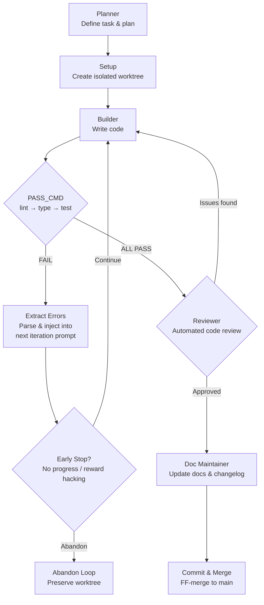

# cc-builder-loop

**N parallel autonomous Claude Code loops on a single project. Your tests decide when code is done — not the LLM.**

`7+ hrs unattended` · `8 parallel loops` · `47 e2e tests` · `25 scripts` · `V1.0 → V3.3, 100+ commits`

An autonomous build-loop system for [Claude Code](https://docs.anthropic.com/en/docs/claude-code) that replaces "LLM says it's done" with **objective machine verdicts** — lint, typecheck, and test exit codes drive every iteration. Each loop runs in an isolated git worktree, so you can run multiple tasks in parallel on the same repo without conflicts.

## Pipeline



## Parallel Execution

Each loop gets its own git worktree and state file. Run N tasks simultaneously on the same project — they share nothing.

```
┌──────────────────┐  ┌──────────────────┐  ┌──────────────────┐
│   Worktree 1     │  │   Worktree 2     │  │   Worktree N     │
│   task: auth     │  │   task: api      │  │   task: ui       │
│   iter 3/5       │  │   iter 1/5       │  │   iter 5/5 PASS  │
│   state: active  │  │   state: active  │  │   state: merged  │
└────────┬─────────┘  └────────┬─────────┘  └────────┬─────────┘
         │                     │                      │
         └─────────────────────┼──────────────────────┘
                               │
                          main branch
```

## Key Features

**Autonomous Loop**
- Stop hook intercepts after every Builder action, runs `pass_cmd` stages in order (lint → type → test)
- Failures are parsed, extracted, and injected into the next iteration prompt automatically
- Runs for hours without human intervention — the longest tested session ran 7+ hours

**Machine Judgment**
- Every state transition is driven by exit codes, not LLM self-assessment
- Multi-layer gate system (L1–L3) filters non-target scenarios before running PASS_CMD
- Smart early stopping detects reward hacking (tests deleted, assertions weakened, no progress across iterations)

**Worktree Isolation**
- Each loop creates a dedicated `git worktree` — parallel loops never touch each other's files
- CWD-based state matching: the stop hook finds the correct state file by the working directory
- Orphan worktree detection and reuse (V3.3): crashed loops leave recoverable worktrees, not garbage

**Full Pipeline**
- Planner → Builder → PASS_CMD → Reviewer → Doc Maintainer → Commit — all automated
- Reviewer-as-gate (V3.0): code only merges to main after automated review passes
- Arbiter agent handles rebase conflicts when merging worktree back

## Quick Start — One Step

**Just clone and hand it to your AI.** The repo is structured so Claude Code (or any coding AI) can read it and configure everything automatically.

```bash
git clone https://github.com/catchmeee2002/cc-builder-loop.git
```

Then open Claude Code and say:

> Read the cc-builder-loop project and set it up in my environment.

That's it. The AI reads `install.sh`, `CLAUDE.md`, and the skill definition, then runs the installer and configures your hooks. No manual steps needed.

<details>
<summary>Manual setup (if you prefer)</summary>

```bash
cd cc-builder-loop
bash install.sh
```

`install.sh` symlinks scripts, agents, and the skill into `~/.claude/`, then registers stop hooks in `settings.json`.

</details>

### Configure your project

Create `.claude/loop.yml` in your project root (or let the wizard generate it — type `/builder-loop` in a project without one):

```yaml
pass_cmd:
  - { stage: "lint",  cmd: "npm run lint",  timeout: 30 }
  - { stage: "type",  cmd: "npm run typecheck", timeout: 30 }
  - { stage: "test",  cmd: "npm run test",  timeout: 120 }

max_iterations: 5

worktree:
  enabled: true
```

### Run

In Claude Code, type `/builder-loop` and describe your task. The loop takes over from there.

## Design Philosophy

The core principle is **layered verdicts** — machine verdicts (test exit codes) form the ground-truth foundation that can't be argued with, while LLM verdicts cover the semantic layer on top. The stronger LLM judges get, the more they need an external anchor they can't talk their way past; this project is that anchor.

Full principles (single source of truth): [`docs/design-philosophy.md`](docs/design-philosophy.md).

## Version Highlights

| Version | Key Capability |
|---------|---------------|
| **V1.0** | Basic loop: stop hook + PASS_CMD + error injection |
| **V2.0** | Worktree isolation, parallel loops, smart early stopping |
| **V2.5** | Diagnostics, observability, abandon flow |
| **V3.0** | Reviewer-as-gate: code only merges after review passes |
| **V3.2** | 47 e2e fixtures, test harness, prompt audit, cross-boundary isolation |
| **V3.3** | Orphan worktree detection and reuse |

Full changelog: [CHANGELOG.md](CHANGELOG.md)

## Project Structure

```
cc-builder-loop/
├── install.sh / uninstall.sh     # Setup & teardown
├── scripts/                      # Hook entry points (stop hook, guards)
├── agents/                       # Subagent definitions (arbiter, tester)
├── skills/builder-loop/
│   ├── SKILL.md                  # Runtime contract & config
│   ├── scripts/                  # Core scripts (19 scripts)
│   │   ├── setup-builder-loop.sh # Loop initialization
│   │   ├── run-pass-cmd.sh       # PASS_CMD executor
│   │   ├── extract-error.sh      # Error parser
│   │   ├── early-stop-check.sh   # Reward hacking detector
│   │   ├── merge-and-cleanup.sh  # Worktree → main merge
│   │   └── ...
│   ├── fixtures/e2e/             # 47 end-to-end test scripts
│   ├── prompts/                  # Builder/reviewer prompt templates
│   └── docs/                     # Design docs & troubleshooting
├── docs/design-philosophy.md
└── CHANGELOG.md
```

## Requirements

- [Claude Code](https://docs.anthropic.com/en/docs/claude-code) (CLI)
- `git` (for worktree isolation)
- `jq` (for hook registration)
- `bash` 4+

## License

MIT — see [LICENSE](LICENSE).

---

<details>
<summary><h2>中文版</h2></summary>

# cc-builder-loop

**在同一个项目上并行运行 N 个自主 Claude Code 循环。由你的测试判定代码是否完成——而不是 LLM 自己说了算。**

`7+ 小时无人值守` · `8 个并行循环` · `47 个端到端测试` · `25 个脚本` · `V1.0 → V3.3, 100+ 次提交`

一个用于 Claude Code 的自主构建循环系统。用 **lint/typecheck/test 的退出码** 驱动每轮迭代，取代「LLM 说改好了」。每个循环在独立的 git worktree 中运行，同一仓库可并行多个任务互不干扰。

### 核心特性

- **自主循环**：Stop hook 在每次 Builder 动作后自动拦截，按顺序执行 pass_cmd → 失败自动提取错误注入下轮 prompt → 无需人工干预
- **机器判据**：所有状态转移由退出码驱动，多层闸过滤机制（L1-L3），智能早停检测作弊（删测试、弱化断言、无进展）
- **Worktree 隔离**：每个循环独占 git worktree，CWD 匹配状态文件，崩溃后孤儿 worktree 可检测复用
- **完整流水线**：Planner → Builder → PASS_CMD → Reviewer → Doc Maintainer → Commit，全自动

### 快速开始 — 一步到位

**克隆项目，然后丢给你的 AI 就行。** 仓库结构对 AI 友好，Claude Code 读一遍就能自动配好所有东西。

```bash
git clone https://github.com/catchmeee2002/cc-builder-loop.git
```

然后在 Claude Code 里说一句：「读一下 cc-builder-loop 项目，帮我配到环境里。」完事。

手动安装：`cd cc-builder-loop && bash install.sh`，然后在你的项目根创建 `.claude/loop.yml` 配置 `pass_cmd`，在 Claude Code 里 `/builder-loop` 启动。

### 设计哲学

核心是**判据分层**——机器判据（测试退出码）做不可被说服的 ground truth 地基，LLM 判据补语义层。LLM 判官越强，越需要一个说服不了的外部锚点，本项目就是这个锚点。

完整原则（唯一来源）：[`docs/design-philosophy.md`](docs/design-philosophy.md)。

</details>
